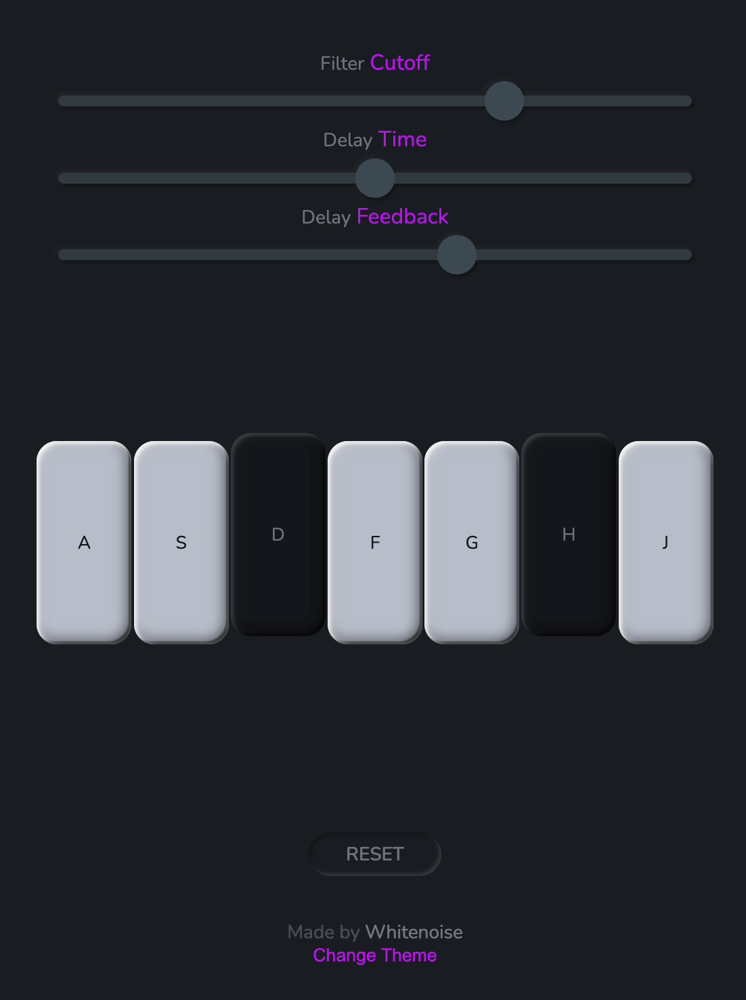

# Tone.js Mini Piano

This is a mini piano application that uses the Tone.js Web Audio framework.

> Learn more about [Tone.js](https://tonejs.github.io/)

## Live Demo

- [Play Now](https://emanuelefavero.github.io/tonejs-mini-piano/)

## Screenshot

## Getting Started

- clone the repo and open the `index.html` file in your browser

## How to play the piano

- If on a desktop, use your keyboard keys `a` through `j` to play the piano
- If on a mobile device, tap on the piano keys to play

## Features

- Filter Cutoff
- Delay Time
- Delay Feedback
- Dark, Light Theme

## License

- [MIT](LICENSE.md)
